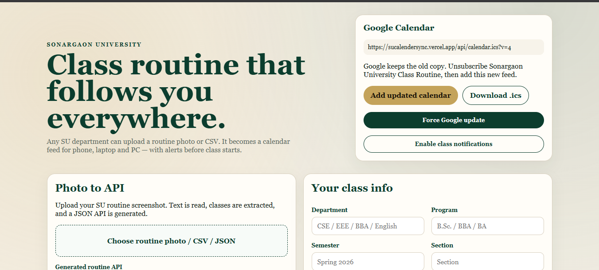
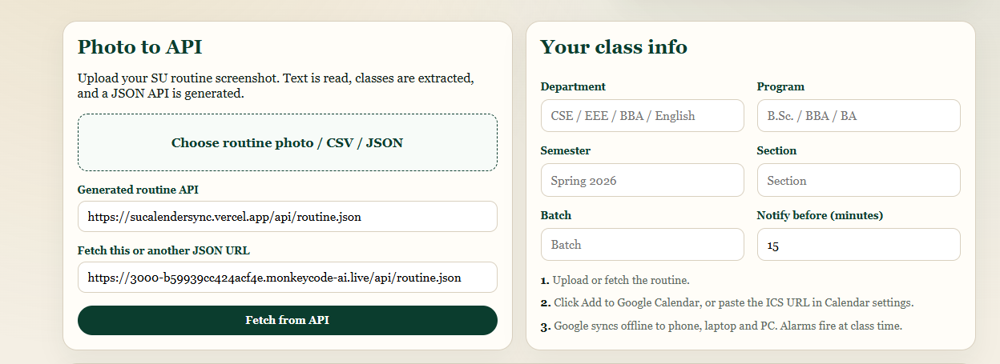
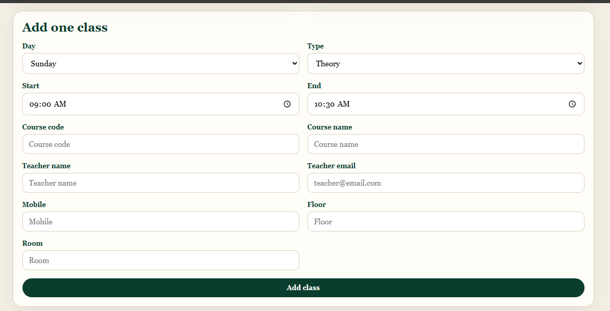
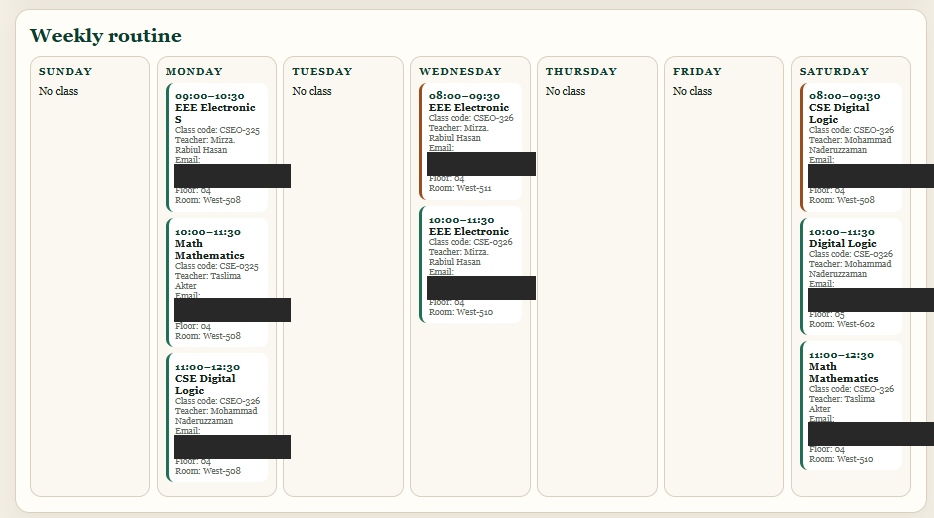

# SU Calendar Sync 📅

A routine and calendar synchronization project built for **Sonargaon University (SU)**.

> 💡 **Inspired by [DIU Calendar Sync](https://github.com/6ayzid/diu-calendar-sync)**
> This project was inspired by the idea and workflow of DIU Calendar Sync and adapted for Sonargaon University students.

---

## 🌐 Live Demo

🔗 **[Open SU Calendar Sync](https://sucalendersync.vercel.app/)**

## 📸 Screenshots

### 🏠 Home Page


### 📷 Upload Routine (Photo / CSV / JSON)


### ➕ Add a Class Manually


### 🗓️ Weekly Routine


---

## 🌟 About

**SU Calendar Sync** is designed to make university routines easier to access and manage.

Instead of repeatedly checking routine images, PDFs, or other static sources, students can view their routine in a structured web interface and use calendar-friendly data for easier schedule management.

## ✨ Features

- 📅 University routine viewer
- 📷 Routine image OCR
- 📄 CSV routine import
- 🧾 JSON routine support
- 🔄 Routine fetch and refresh APIs
- 📆 `.ics` calendar generation
- 🔔 Browser notification support
- 📱 Responsive interface for mobile and desktop
- ⚡ Built with Next.js App Router

---

## 🛠️ Tech Stack

- **Next.js**
- **React**
- **JavaScript / JSX**
- **CSS**
- **Node.js**
- **Tesseract OCR**
- **iCalendar / ICS**

---

## 🚀 Getting Started

### Requirements

- [Node.js](https://nodejs.org/) (version 18 or newer)
- npm (comes with Node.js)
- Git

### Installation

```bash
# 1. Clone the repository
git clone https://github.com/mdsolimansikder7/SU-Calender-Sync.git

# 2. Go into the project folder
cd SU-Calender-Sync

# 3. Install dependencies
npm install

# 4. Start the development server
npm run dev
```

Now open **http://localhost:3000** in your browser.

### Build for Production

```bash
npm run build
npm start
```

---

## 📖 How to Use

1. Open the website.
2. Load your routine in one of these ways:
   - 📷 Upload a routine **image** (OCR will read it)
   - 📄 Import a **CSV** file (see `data/sample-routine.csv`)
   - 🧾 Use a **JSON** file (see `public/sample-routine.json`)
3. Check your classes in the routine viewer.
4. Download the **`.ics`** calendar file.
5. Import the `.ics` file into your calendar app:
   - **Google Calendar:** Settings → Import & export → Import
   - **Apple Calendar:** File → Import
   - **Outlook:** File → Open & Export → Import/Export
6. Turn on browser notifications to get class reminders.

### Sample CSV Format

Check `data/sample-routine.csv` to see the exact columns the app expects.

---

## 🔌 API Routes

| Route | Description |
|-------|-------------|
| `/api/routine` | Get the current routine |
| `/api/routine.json` | Routine data in JSON format |
| `/api/calendar.ics` | Download the calendar file |
| `/api/fetch` | Fetch routine data |
| `/api/refresh` | Refresh the routine data |

---

## 🐳 Run with Docker

The project includes a `Dockerfile`.

```bash
# Build the image
docker build -t su-calendar-sync .

# Run the container
docker run -p 3000:3000 su-calendar-sync
```

Then open **http://localhost:3000**.

---

## 📁 Project Structure

```text
SU-Calender-Sync/
├── app/
│   ├── api/
│   │   ├── calendar.ics/
│   │   ├── fetch/
│   │   ├── refresh/
│   │   ├── routine/
│   │   └── routine.json/
│   ├── globals.css
│   ├── layout.jsx
│   └── page.jsx
│
├── data/
│   ├── routine.json
│   └── sample-routine.csv
│
├── lib/
│   ├── classDetails.js
│   ├── faculty.js
│   ├── ics.js
│   ├── ocr.js
│   ├── parseOcr.js
│   ├── parseRoutine.js
│   └── store.js
│
├── public/
│   ├── favicon.svg
│   ├── manifest.json
│   ├── sample-routine.csv
│   ├── sample-routine.json
│   └── sw.js
│
├── Dockerfile
├── next.config.mjs
├── package.json
└── README.md
```

---

## 🤝 Contributing

Contributions are welcome!

1. Fork the repository
2. Create a new branch: `git checkout -b feature/my-feature`
3. Commit your changes: `git commit -m "Add my feature"`
4. Push to your branch: `git push origin feature/my-feature`
5. Open a Pull Request

---

## 🙏 Credits

- Inspired by [DIU Calendar Sync](https://github.com/6ayzid/diu-calendar-sync)
- Built for the students of Sonargaon University

## 👤 Author

**Soliman**
GitHub: [@mdsolimansikder7](https://github.com/mdsolimansikder7)
